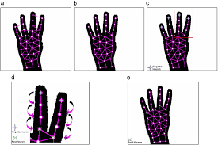
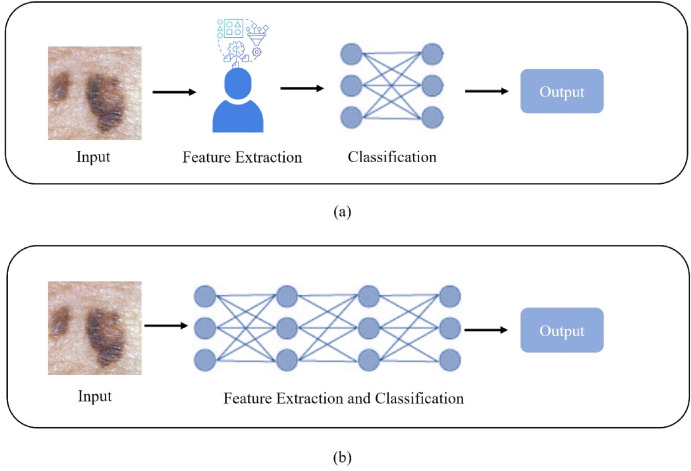
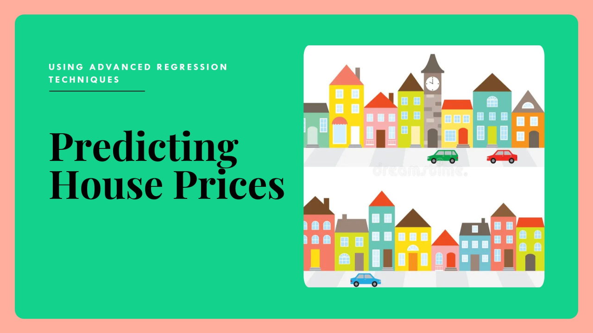

# Data Science Portfolio
---
## Machine learning Projects

### Gesture Recognition

This project involved developing a machine learning model to enable gesture-based control of a smart TV. 
The goal was to create a user-friendly experience that allows viewers to interact with the TV using five predefined hand gestures captured by a webcam.

This project showcases my proficiency in machine learning for computer vision tasks, particularly gesture recognition. I am adept at data preprocessing, model selection, training, and evaluation, and I am passionate about developing innovative solutions that enhance user experience.

Suggestion: Better to download Anaconda as it will take care of most of the other packages and easier to setup a virtual workspace to work with multiple versions of key packages like python, opencv etc.

---

### Ticket Classification

Developed a machine learning model to automate the classification of customer complaints for a financial company. The goal was to efficiently categorize incoming support tickets based on the mentioned products and services, enabling faster resolution and improved customer satisfaction.

Successfully implemented topic modeling to categorize unstructured customer complaints into relevant product/service categories.

Built and evaluated multiple supervised learning models, selecting the optimal one for accurate and efficient classification of new complaints.

Automated the customer support ticket system, leading to faster issue resolution and improved customer experience.

This project demonstrates my skills in natural language processing, topic modeling, and supervised machine learning. 

---

### Melanoma Detection

Developed a multiclass image classification model using a custom Convolutional Neural Network (CNN) in TensorFlow to detect melanoma, a deadly form of skin cancer.  The goal was to create a tool to assist dermatologists in early diagnosis.

Designed and implemented a CNN architecture tailored for melanoma classification, incorporating convolutional layers, max-pooling, and fully connected layers.

This project showcases my skills in deep learning, CNN architecture design, and image classification using TensorFlow. 

---
### Custom Chatbot with LLMs

Developed an AI-powered chatbot to simplify holiday planning.  Leveraging OpenAI's APIs and function-calling capabilities, the chatbot assists users in selecting personalized holiday packages based on their preferences (destination, budget, duration, etc.).

Built a functional chatbot that understands user preferences and provides tailored holiday package recommendations. Successfully integrated external APIs for enhanced functionality and user experience.

Addressed challenges related to repeated responses, ambiguous inputs, and context maintenance in long conversations.

This project demonstrates my skills in chatbot development, natural language processing, API integration, and system design.

---
### Advance Regression

Developed a polynomial regression model using regularization techniques (Ridge and Lasso) to predict house prices and identify key price drivers.  The goal was to assist a US-based housing company (Surprise Housing) in understanding the Australian market for potential investment opportunities.

Built a predictive model for house prices using polynomial regression and regularization.

Identified the most significant variables influencing house prices.

Selected Lasso regression as the final model due to its ability to create a simpler model with key feature. 

This project demonstrates my skills in data analysis, feature engineering, regularization techniques, and model selection for regression tasks.

---

### Mr. HelpMate AI Chatbot

Developed Mr.HelpMate AI, a generative search system designed to efficiently answer questions about a specific policy document.  The system uses NLP and machine learning to provide concise and informative answers directly extracted from the document.

**Data Preparation:** Loaded and processed the policy document, chunked the text, and created embeddings for each chunk.

**Embedding and Indexing:** Used ChromaDB to store and retrieve embeddings efficiently.

**Query Processing:** Embedded user queries and performed similarity searches against the indexed document chunks. Implemented re-ranking using a cross-encoder model.

**Answer Generation:** Integrated the OpenAI API (GPT-4) to generate concise answers from the top retrieved document chunks using prompt engineering.

This project demonstrates my skills in natural language processing, information retrieval, large language model integration, and system design. 

---

### Human Activity Recognition

Human Activity Recognition (HAR) using smartphones dataset and an LSTM RNN. Classifying the type of movement amongst six categories:

WALKING,
WALKING_UPSTAIRS,
WALKING_DOWNSTAIRS,
SITTING,
STANDING,
LAYING.
Compared to a classical approach, using a Recurrent Neural Networks (RNN) with Long Short-Term Memory cells (LSTMs) require no or almost no feature engineering. Data can be fed directly into the neural network who acts like a black box, modeling the problem correctly. Other research on the activity recognition dataset can use a big amount of feature engineering, which is rather a signal processing approach combined with classical data science techniques. The approach here is rather very simple in terms of how much was the data preprocessed.

Let's use Google's neat Deep Learning library, TensorFlow, demonstrating the usage of an LSTM, a type of Artificial Neural Network that can process sequential data / time series.

